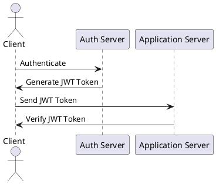
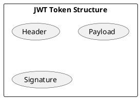
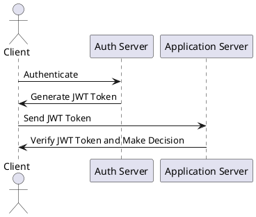

# Custom Authorization Mechanism

## Overview

Our system uses JSON Web Tokens (JWT) for secure authorization of clients. The authentication server generates a JWT on
successful user authentication, and the client uses this token to access resources on our server.

## JWT Structure

A JWT has three parts: a header, a payload, and a signature. The header contains information about the signing
algorithm. The payload contains the claims, which are statements about the subject (user). The signature verifies that
the token is trustworthy and has not been tampered with.

## Authorization Flow

1. **Token Generation**: User authenticates and receives a JWT from the authentication server.
2. **Token Transmission**: Client sends this token in the `Authorization` header with every HTTP request.
3. **Token Verification**: Server verifies the token's signature and checks the claims in the payload.
4. **Access Decision**: If verification is successful and the user has necessary permissions, server grants access. If
   not, it returns HTTP 401 Unauthorized or 403 Forbidden.

## Permissions Configuration

We define roles and map these to permissions using a YAML configuration file. This gives us a very flexible system where
permissions can be updated easily without changing the code.

In development, you can use a simple token with a single user role for testing. In production, use a robust system for
managing tokens and assigning different roles to different users. Remember, JWTs can be decoded by anyone who has the
token, so don't include sensitive information in the payload.

In the future, we plan to add a feature to dynamically reload permissions from the YAML file without restarting the
server and we're also exploring the possibility of integrating with third-party identity providers.