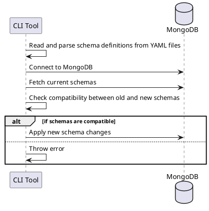

# CLI Tool for MongoDB Schema Migration

The CLI tool is a separate program developed to handle MongoDB schema migrations. It will read the schema definitions
provided in the YAML configuration files and apply them to the MongoDB instance. The CLI tool also provides utilities
for checking the compatibility between the old and new schema definitions to avoid data corruption or loss during
migration.

## How It Works

1. **Reading the Schema Definitions:** The CLI tool starts by reading the YAML files that contain the schema
   definitions. These files are read and parsed into an internal data structure that the tool can use for the rest of
   the operations.

2. **Connecting to MongoDB:** The CLI tool then establishes a connection to the MongoDB instance where the schema
   changes will be applied.

3. **Checking Compatibility:** The CLI tool fetches the current schema of each collection from MongoDB and compares it
   with the schema definition from the YAML files. If the new schema is not compatible with the existing schema (i.e.,
   the old data can't be converted to fit the new schema), the tool will throw an error.

4. **Applying Schema Changes:** If all compatibility checks pass, the CLI tool applies the new schema changes to
   MongoDB.

## Diagram

Here's a simple PlantUML sequence diagram that shows the interaction flow in the CLI tool:

In this diagram, the CLI tool starts the process, reads the YAML files, and connects to MongoDB. It fetches the current
schemas and checks if they are compatible with the new schemas. If they are compatible, the new schemas are applied;
otherwise, an error is thrown.

Remember, this is a simplified view of the process. The actual implementation might need to handle additional details,
like authentication, error handling, logging, and more.