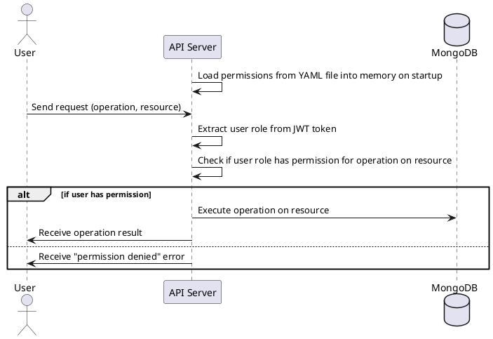

# Permissions and Access Control

This document provides a description of how permissions and access control are managed in the system.

## Permissions

Permissions in the system are defined in a YAML file. Each permission corresponds to a specific operation on a specific
resource (collection).

The permissions file is structured as follows:

```yaml
permissions:
  - resource: resourceName
    action: actionType
    roles: [ role1, role2, ... ]
  - resource: anotherResourceName
    action: actionType
    roles: [ role1, role2, ... ]
  ...
```

For example:

```yaml
permissions:
  - resource: users
    action: create
    roles: [ admin, editor ]
  - resource: users
    action: read
    roles: [ admin, editor, user ]
```

In this example, the `admin` and `editor` roles can create new users, and `admin`, `editor`, and `user` roles can read
user data.

The `resource` field corresponds to the MongoDB collection the permission is for.

The `action` field can be one of the following CRUD operations: `create`, `read`, `update`, `delete`.

The `roles` field is a list of roles that are granted this permission.

## Role-Permission Mapping

The permission definitions described above form a role-permission mapping, which is used to determine whether a user (
based on their role) is allowed to perform a specific operation on a specific resource.

The following PlantUML sequence diagram shows the flow of an incoming request and the role-permission checking process:



In this diagram, the user sends a request to the API server, which reads the permissions from the YAML file. It then
extracts the user role from the JWT token and checks if this role has the required permission. If the user has the
permission, the operation is executed on the resource, and the result is returned to the user. If the user doesn't have
the permission, a "permission denied" error is returned.

By using a permissions file and role-permission mapping, we can easily manage and change permissions in a flexible and
scalable way.