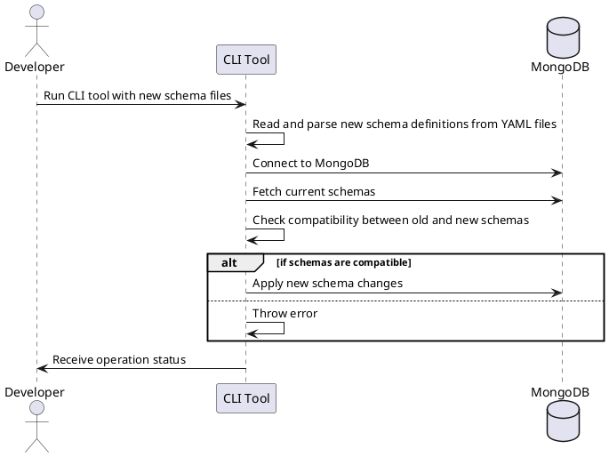

# MongoDB Schema Definitions

This document details how schema definitions are managed in this system. These definitions are expressed in YAML format
and provide the basis for the data structure of each collection in the MongoDB database.

## Schema Definition Files

Each collection has its own schema definition file. This file contains the field definitions and validation rules for
the data in the collection.

The schema definition file is structured as follows:

```yaml
collectionName:
  fieldName:
    type: dataType
    required: true/false
    unique: true/false
  anotherFieldName:
    type: dataType
    required: true/false
    ...
```

For example:

```yaml
users:
  username:
    type: String
    required: true
    unique: true
  email:
    type: String
    required: true
    unique: true
```

The `type` field specifies the data type of the field, e.g., `String`, `Number`, `Date`, `Array`, etc.

The `required` field specifies whether this field must be present in every document in the collection.

The `unique` field specifies whether the value of this field must be unique across the collection.

## Handling Schema Changes

Schema changes are handled through the CLI tool. When a schema definition file is modified, the CLI tool is used to
apply the changes to the MongoDB database.

Here's a PlantUML sequence diagram that shows the flow of handling schema changes:



In this diagram, the developer initiates the schema update process by running the CLI tool. The tool reads the new
schema definitions, connects to MongoDB, fetches the current schemas, and checks the compatibility. If the new schemas
are compatible, they are applied to the database. The operation status is then communicated back to the developer.

This approach allows us to safely manage schema changes and avoid potential issues with data compatibility or loss.